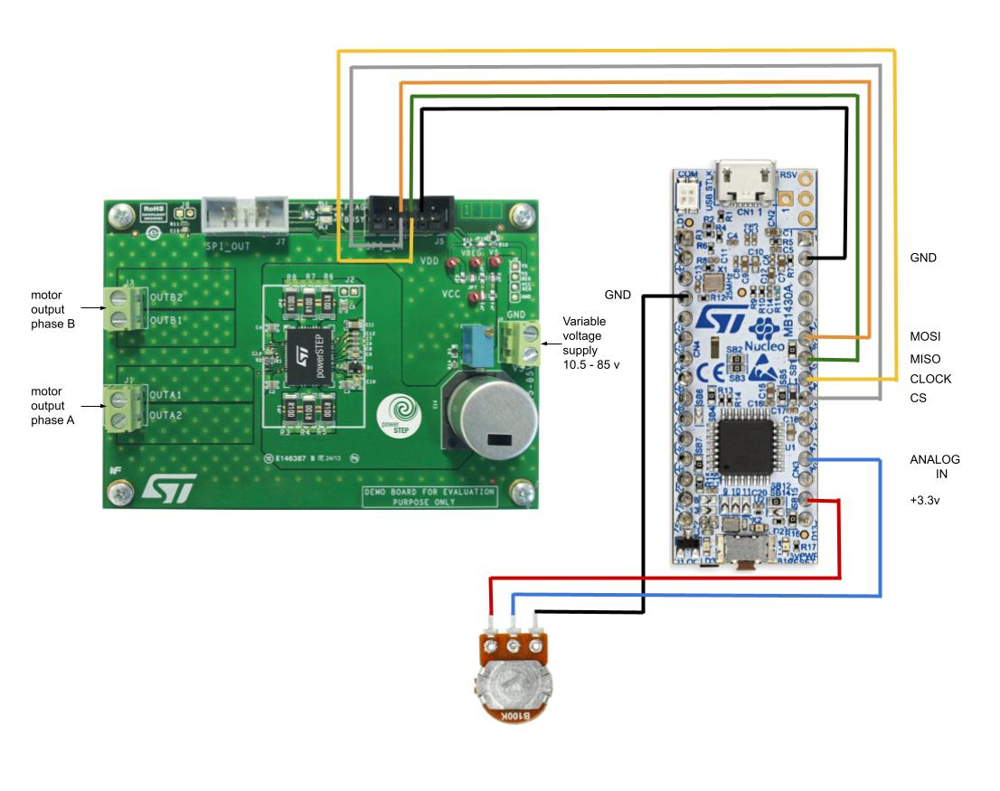
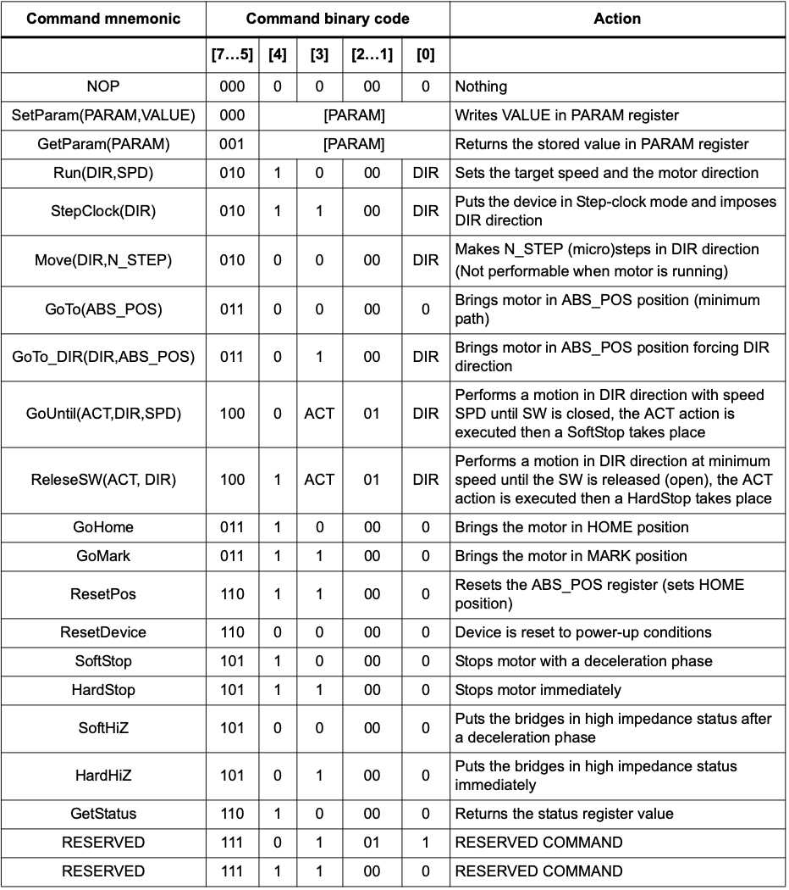
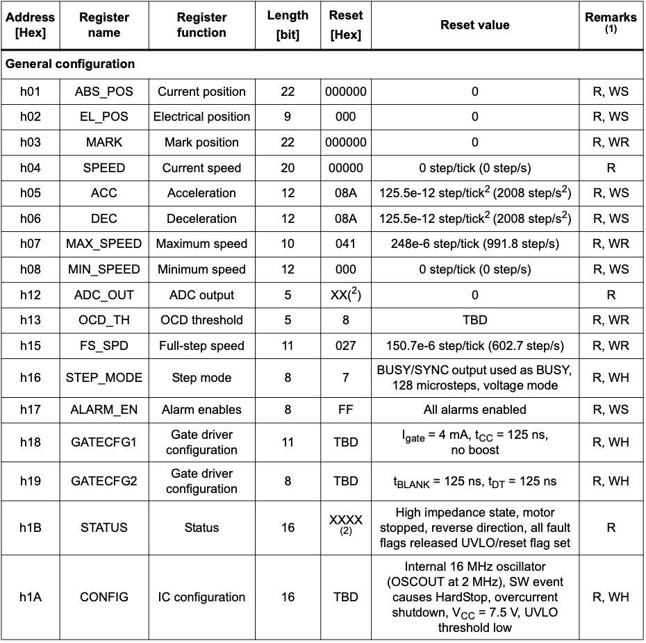
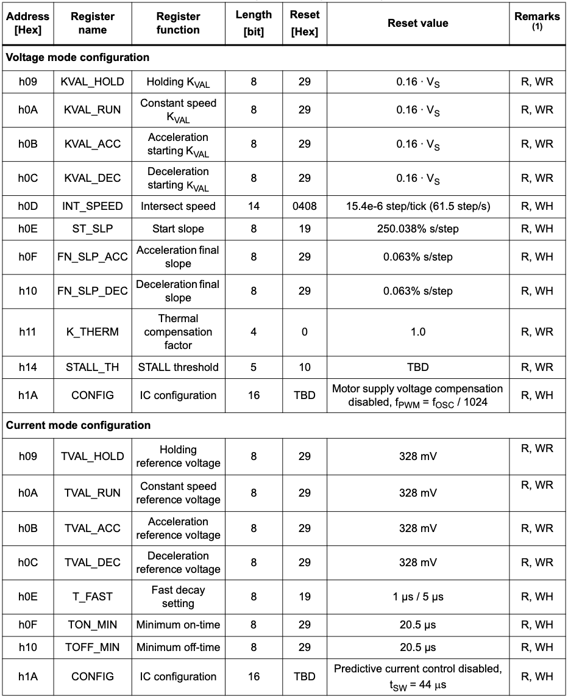

# EVLPOWERSTEP01 control via SPI with STM 32 Nucleo G4
## Intro
#### This repository was made to simplify communication with EVLPOWERSTEP01 driver for stepper motors. Normally the user would need to input one or more bytes in code. With this code the user can send commands to the driver via UART from terminal. The microcontroller receives the command and sends the coresponding bytes via SPI to the driver.

## Connection of EVLPOWERSTEP01 driver board with Nucleo G4

## Commands
The commands are based on the driver's chip datasheet available [HERE](https://www.st.com/resource/en/datasheet/powerstep01.pdf) on page 73 section 11.2. 
The application commands and shown below.

 Some of the commands shown above need register values. Those are shown below or [HERE](https://www.st.com/resource/en/datasheet/powerstep01.pdf) on page 51 section 11.1.

### Examples:
- Motor spinning in forward direction with 200 steps/sec - user should input:  **"Run(1,200)"**, for reverse it would be "0" not "1".
- Setting bridges in high impedance mode - user should input: **"HardHiZ"**.
- Switching the driver to Full-Step mode - user should input: **"SetParam(16,00)"** First byte indicates register value in hex 16 - STEP_MODE while the second byte corresponds to parameters set. More info in data sheet on page 61 section 11.1.23.
- Checking the status of the device - user should input:   **"GetParam(1B)"** Analogically, the 1B corresponds to the register value of STATUS register. The received answer will be presented in bytes.

## Extra commands
To make the control experience more flexible, some extra commands have been added as well. These commands initiate many manufacturer's commands at once.
- **"Factory"** - This command stops the motor and puts the bridges into HardHiZ and then resets the device to initial conditions with default parameters set in the register values of POWERSTEP01. The default values might not be the most suitable for your motor. These parameters can be changed by **"SetParam()"**  command for GATECFG1 and GATECFG2 respectively. More information from manufacturer available [HERE](https://www.st.com/resource/en/user_manual/um1829-powerstep01-systeminpackage-integrating-microstepping-controller-and-10-a-power-mosfets-evaluation-board-stmicroelectronics.pdf) on page 10 section 3.3

- **"Run_RPM(<bool_dir>,<int_speed>)"** - This command works like normal **"Run()"** command but in this function the second value is not expressed in [rot/min] but in [steps/sec].
> [!IMPORTANT]
>Depending on the motor's no. of steps, first the **"SetSteps()"** command should be initiated in order to make the command function properly.

- **"SetCoef(<int_coef>)"** - This command sets the coefficient for the potentiometer making it more or less sensitive. Any number can be inputted in the brackets. To input float the value should be smallet than 100 as the coeficient is later multplied by 0.01. More details can be found in the chapter [Potentiometer speed control](#potentiometer-speed-control)

- **"SetSteps(<int_steps>)"** - This command sets the number of steps present in the stepper motor. This parameter is set to 200 as a default.
- **"Save"** - This command saves all of the parameters to the emulated EEPROM of the Nucleo G4. More details can be found in the chapter [Storing register data in emulated EEPROM](#storing-register-data-in-emulated-eeprom)
- **"Init"** - This command reads the parameters stored in emulated EEPROM and sets them in the POWERSTEP01

## Launching the code for the first time
Once the code is succesfuly uploaded and all connections are done accordingly to the provided scheme, the user should connect via UART using terminal. The boudrate should be set to 115200 bit/s and carriage return enabled. When the connection is established, the user should input first the command **"Factory"**  or use **"SetParam()"** for each setting separately. Next the number of steps should be set using **"SetSteps()"** command. If potentiometer is used the **"SetCoef()"** command can be used to increase the sensitivity.
## Potentiometer speed control
A potentiomter can be added as shown on the connection scheme [HERE](img_readme/photo.jpg). When it's added, user can change the speed of the stepper motor manually without using the terminal. When potentiometer is set to a value other than 0 the UART connection is disabled as a safety feature.
> [!IMPORTANT]
> If potentiometer is used, the user might need to change the coefficient using for example "SetCoef()" command to lower it for slower motors to make the poteniometer output finer for user. 

## Storing register data in emulated EEPROM
To store configuration parameters permanently the emulated EEPROM has been added. This gives the user more flexibility, meaning that when the user is trying out new parameters for the motor they can be easily reset. If they increase the performance, the user can overwrite the old ones with new ones. This can be done with  **"Save"** to save the configuration permanently or **"Init"** if we want to load the saved configuration from the emulated EEPROM.
#### The folowing list contains register values stored in the emulated EEPROM
- STEPS of the motor
- COEFFICIENT
- GATECFG1
- GATECFG2
- KVAL/TVAL_HOLD
- KVAL/TVAL_RUN
- KVAL/TVAL_ACC
- KVAL/TVAL_DEC
- STEP_MODE

## License
This project is licensed under the Apache 2.0 License - see the [LICENSE](LICENSE.md) file for details.